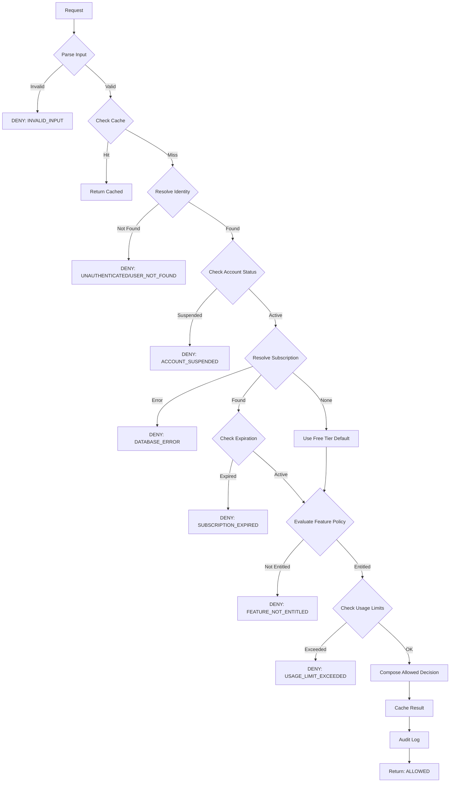

# Identity & Subscription Engine

Production-grade authorization engine for the ZimPrep examination platform.

## Purpose

The Identity & Subscription Engine is the **single source of truth for authorization decisions** in ZimPrep. It runs early in every request pipeline to determine:

1. **Who is the user?** (identity resolution)
2. **What role do they have?** (student, parent, teacher, school_admin)
3. **What subscription tier are they on?** (free, premium, school)
4. **What features are they entitled to?** (exam access, AI explanations, analytics, etc.)
5. **What usage limits apply?** (daily exam limits, weekly AI explanation quotas)
6. **Should this request proceed?** (allow/deny with explicit reason)

This engine is **production-grade**, **economically safe**, **legally defensible**, and **fully auditable**.

## Core Principles

### 1. Fail-Closed by Design
- Any ambiguity → **DENY**
- Any database error → **DENY**
- Any cache inconsistency → **DENY**
- All denials include explicit, enumerated reasons

### 2. Single Responsibility
- Does NOT handle authentication (login/logout)
- Does NOT load exam content
- Does NOT call AI services
- Does NOT invoke other engines

### 3. Immutable Output
- Returns frozen `IdentitySubscriptionOutput` snapshot
- Output cannot be mutated after creation
- Output is the final word on authorization

### 4. Full Auditability
- Every decision is logged with structured metadata
- All denials are traceable to specific reasons
- Confidence scores track data quality

## Input Contract

```python
class IdentitySubscriptionInput(BaseModel):
    trace_id: str
    auth_context: Optional[AuthContext]  # null for unauthenticated requests
    requested_action: RequestedAction
    bypass_cache: bool = False
```

**Fields**:
- `trace_id`: Request trace ID for debugging
- `auth_context`: Validated token payload (user_id, session_id, claims)
- `requested_action`: Action being requested (action_type, subject, paper, metadata)
- `bypass_cache`: Force re-evaluation, skip cache

## Output Contract

```python
class IdentitySubscriptionOutput(BaseModel):
    allowed: bool
    resolved_identity: Optional[ResolvedIdentity]
    resolved_role: Optional[UserRole]
    subscription_state: Optional[SubscriptionState]
    enabled_features: list[str]
    usage_limits: Optional[UsageLimits]
    denial_reason: Optional[DenialReason]
    denial_message: Optional[str]
    confidence: float
    cached: bool
    metadata: dict
```

**Fields**:
- `allowed`: Final authorization decision (true/false)
- `resolved_identity`: User identity (user_id, email, account_id, account_type)
- `resolved_role`: User role (student, parent, teacher, school_admin)
- `subscription_state`: Subscription tier, status, features, expiration
- `enabled_features`: List of enabled feature keys
- `usage_limits`: Current usage and limits for rate-limited actions
- `denial_reason`: Explicit reason if denied (see taxonomy below)
- `denial_message`: Human-readable denial message
- `confidence`: 0.0-1.0 (1.0 = all DB lookups succeeded)
- `cached`: Whether result was served from cache
- `metadata`: Additional trace metadata

## Denial Reason Taxonomy

All denials include one of these explicit reasons:

| Reason | Category | Description |
|--------|----------|-------------|
| `UNAUTHENTICATED` | Authentication | No auth context provided |
| `INVALID_TOKEN` | Authentication | Token validation failed |
| `USER_NOT_FOUND` | Identity | User not found in database |
| `ACCOUNT_NOT_FOUND` | Identity | Account not found |
| `ACCOUNT_SUSPENDED` | Account Status | Account administratively suspended |
| `USER_INACTIVE` | Account Status | User account inactive |
| `SUBSCRIPTION_EXPIRED` | Subscription | Subscription ended |
| `SUBSCRIPTION_CANCELLED` | Subscription | Subscription cancelled |
| `SUBSCRIPTION_SUSPENDED` | Subscription | Subscription suspended (payment) |
| `NO_ACTIVE_SUBSCRIPTION` | Subscription | No active subscription |
| `FEATURE_NOT_ENTITLED` | Feature | Feature not in subscription tier |
| `FEATURE_DISABLED` | Feature | Feature disabled via flag |
| `USAGE_LIMIT_EXCEEDED` | Rate Limit | Quota exceeded |
| `DAILY_LIMIT_EXCEEDED` | Rate Limit | Daily limit exceeded |
| `WEEKLY_LIMIT_EXCEEDED` | Rate Limit | Weekly limit exceeded |
| `DATABASE_ERROR` | Infrastructure | Database failure (fail-closed) |
| `CACHE_ERROR` | Infrastructure | Cache failure (logged) |
| `CACHE_INCONSISTENCY` | Infrastructure | Cache validation failed |
| `AMBIGUOUS_STATE` | Integrity | Conflicting states detected |
| `INVALID_INPUT` | Validation | Input validation failed |
| `UNKNOWN_ERROR` | Fallback | Unclassified error |

## Decision Flow



## Subscription Tiers & Features

### Free Tier
- Basic exam access
- 5 exams per day
- Basic analytics
- Practice mode (10 sessions/day)
- **No AI features**

### Premium Tier
- Unlimited exam access
- Advanced analytics
- AI explanations (50/week)
- AI recommendations
- Data export
- Parent dashboard
- Practice mode (unlimited)

### School Tier
- All premium features
- School administration
- Bulk operations
- SSO integration
- Unlimited everything

## Caching Strategy

### Entitlement Cache
- **TTL**: 5 minutes (configurable)
- **Key**: `entitlement:{user_id}:{action_type}`
- **Invalidation**: On subscription change, user update
- **Behavior**: Cache only allowed responses

### Rate Limit Cache
- **Implementation**: Redis sorted sets (sliding window)
- **Keys**: `ratelimit:{user_id}:{action_type}`
- **Windows**: 24h (daily), 7d (weekly), 30d (monthly)
- **Auto-expiration**: Window duration + 1 hour buffer

## Database Schema

### Users Table
```sql
CREATE TABLE users (
    id VARCHAR(50) PRIMARY KEY,
    email VARCHAR(255) UNIQUE NOT NULL,
    account_id VARCHAR(50) NOT NULL,
    status VARCHAR(20) NOT NULL DEFAULT 'active',
    role_override VARCHAR(20),
    created_at TIMESTAMP NOT NULL,
    updated_at TIMESTAMP NOT NULL
);
```

### Accounts Table
```sql
CREATE TABLE accounts (
    id VARCHAR(50) PRIMARY KEY,
    name VARCHAR(255) NOT NULL,
    type VARCHAR(20) NOT NULL,  -- individual, family, school
    status VARCHAR(20) NOT NULL DEFAULT 'active',
    owner_user_id VARCHAR(50) NOT NULL,
    created_at TIMESTAMP NOT NULL,
    updated_at TIMESTAMP NOT NULL
);
```

### Subscriptions Table
```sql
CREATE TABLE subscriptions (
    id VARCHAR(50) PRIMARY KEY,
    account_id VARCHAR(50) NOT NULL,
    tier VARCHAR(20) NOT NULL,  -- free, premium, school
    status VARCHAR(20) NOT NULL,  -- active, trial, expired, cancelled, suspended
    is_trial BOOLEAN NOT NULL DEFAULT FALSE,
    start_date TIMESTAMP NOT NULL,
    end_date TIMESTAMP,
    trial_end_date TIMESTAMP,
    features JSON,
    metadata JSON,
    created_at TIMESTAMP NOT NULL,
    updated_at TIMESTAMP NOT NULL
);
```

### Feature Flag Overrides Table
```sql
CREATE TABLE feature_flag_overrides (
    id VARCHAR(50) PRIMARY KEY,
    user_id VARCHAR(50) NOT NULL,
    feature_key VARCHAR(100) NOT NULL,
    enabled BOOLEAN NOT NULL,
    reason VARCHAR(255),
    expires_at TIMESTAMP,
    created_at TIMESTAMP NOT NULL
);
```

## Usage Example

### Via Orchestrator
```python
from app.orchestrator.orchestrator import orchestrator
from app.orchestrator.execution_context import ExecutionContext

context = ExecutionContext.create()

result = await orchestrator.execute(
    engine_name="identity_subscription",
    payload={
        "trace_id": context.trace_id,
        "auth_context": {
            "user_id": "user-123",
            "session_id": "sess-456"
        },
        "requested_action": {
            "action_type": "VIEW_AI_EXPLANATION",
            "subject": "mathematics",
            "paper": "paper-1"
        }
    },
    context=context
)

if result.success and result.data.allowed:
    # Proceed with request
    print("Allowed!")
else:
    # Deny request
    print(f"Denied: {result.data.denial_reason}")
```

### Direct Usage
```python
from app.engines.identity_subscription.engine import IdentitySubscriptionEngine

engine = IdentitySubscriptionEngine()

response = await engine.run(
    payload={...},
    context=context
)
```

## Fail-Closed Examples

### Example 1: Database Connection Failure
```python
# Database is down
→ Engine catches DatabaseError
→ Returns: allowed=False, denial_reason=DATABASE_ERROR
→ Logs: ERROR level with stack trace
```

### Example 2: Multiple Active Subscriptions
```python
# Account has 2 active subscriptions (data integrity issue)
→ SubscriptionRepository raises AmbiguousStateError
→ Returns: allowed=False, denial_reason=AMBIGUOUS_STATE
→ Logs: ERROR level with subscription IDs
```

### Example 3: Cache Inconsistency
```python
# Cached subscription tier != DB subscription tier
→ Engine detects mismatch
→ Invalidates cache
→ Re-fetches from DB
→ If still inconsistent: DENY with CACHE_INCONSISTENCY
```

## Monitoring & Observability

### Metrics to Track
- **Authorization Rate**: requests/second
- **Allow/Deny Ratio**: % allowed vs denied
- **Denial Reasons Distribution**: most common denial reasons
- **Cache Hit Rate**: % requests served from cache
- **Engine Latency**: p50, p95, p99 response times
- **Database Errors**: count of DB failures
- **Confidence Score Distribution**: % requests with confidence < 1.0

### Audit Logs
All decisions are logged with:
- `trace_id`: Request identifier
- `user_id`: User identifier (if authenticated)
- `action`: Action type
- `allowed`: Decision
- `denial_reason`: Reason if denied
- `confidence`: Confidence score
- `timestamp`: ISO 8601 timestamp
- `metadata`: Additional context

## Error Handling

All errors are caught and converted to fail-closed denials:

1. **Input Validation Errors** → `INVALID_INPUT`
2. **Database Errors** → `DATABASE_ERROR`
3. **Identity Resolution Errors** → `USER_NOT_FOUND` or `ACCOUNT_NOT_FOUND`
4. **Subscription Resolution Errors** → `NO_ACTIVE_SUBSCRIPTION` or `AMBIGUOUS_STATE`
5. **Unknown Errors** → `UNKNOWN_ERROR` (investigated and classified)

## Development

### Running Tests
```bash
pytest app/engines/identity_subscription/tests/ -v --cov
```

### Local Setup
1. Install dependencies: `pip install -r requirements.txt`
2. Configure `.env` with `DATABASE_URL` and `REDIS_URL`
3. Run migrations (create tables)
4. Start FastAPI: `uvicorn app.main:app --reload`

## Version History

- **1.0.0** (2025-12-21): Initial production release

## License

Proprietary - ZimPrep Educational Platform
