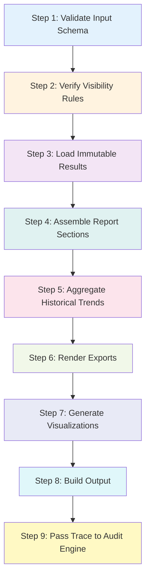

# Reporting & Analytics Engine

**Version**: 1.0.0  
**Type**: Core Engine (NON-AI)  
**Confidence**: Always 1.0 (Deterministic)

---

## Table of Contents

1. [Purpose & Scope](#purpose--scope)
2. [Legal & Regulatory Context](#legal--regulatory-context)
3. [Engine Characteristics](#engine-characteristics)
4. [Execution Flow](#execution-flow)
5. [Role Visibility Matrix](#role-visibility-matrix)
6. [Input/Output Contracts](#inputoutput-contracts)
7. [Why This Engine is Non-AI](#why-this-engine-is-non-ai)
8. [Audit Defensibility](#audit-defensibility)
9. [Failure Scenarios](#failure-scenarios)
10. [Integration Guide](#integration-guide)

---

## Purpose & Scope

The **Reporting & Analytics Engine** transforms immutable exam results into human-readable, role-appropriate insights.

### What This Engine DOES

- ✅ Formats finalized exam results for human consumption
- ✅ Aggregates marks by topic and time period
- ✅ Visualizes performance data for UI rendering
- ✅ Exports reports to PDF, CSV, and JSON formats
- ✅ Enforces role-based visibility rules
- ✅ Produces deterministic output (confidence = 1.0)

### What This Engine DOES NOT DO

- ❌ Calculate or modify marks
- ❌ Recalculate exam results
- ❌ Perform AI reasoning or predictions
- ❌ Infer student capability beyond presenting facts
- ❌ Call other engines directly
- ❌ Write to Results storage

---

## Legal & Regulatory Context

This engine operates in a **legally critical** environment:

### National Exam Compliance

- Reports generated by this engine may be used in **grade appeals**
- All outputs must be **auditable and reproducible**
- Reports must be **role-appropriate** (students, parents, schools see different views)
- Export formats (PDF, CSV) are subject to **data protection regulations**

### Data Protection

- **PII Redaction**: Parent reports exclude raw marks; school reports may anonymize student names
- **Role Enforcement**: Visibility rules prevent unauthorized data access
- **Watermarking**: PDF exports include generation timestamp for authenticity
- **Link Expiry**: Export download links expire after 24 hours

### Audit Requirements

- Every report generation is **traced** via `trace_id`
- All inputs and outputs are **logged** for forensic reconstruction
- Deterministic output ensures **reproducibility** for appeals
- Confidence = 1.0 signals "no AI inference occurred"

---

## Engine Characteristics

| Property | Value |
|----------|-------|
| **Engine Name** | `reporting_analytics` |
| **Version** | `1.0.0` |
| **Type** | Core Engine (NON-AI) |
| **Confidence** | Always `1.0` (deterministic) |
| **Data Mutation** | None (read-only) |
| **External Dependencies** | None (operates on pre-computed results) |
| **Pipeline Position** | AFTER Results Engine, Recommendation Engine<br>BEFORE Audit & Compliance Engine |

---

## Execution Flow

The engine follows a strict **9-step deterministic flow**:



### Step-by-Step Breakdown

#### Step 1: Validate Input Schema
- Pydantic validates all fields in `ReportingInput`
- Ensures `trace_id`, `user_id`, `role`, `subject_code`, `exam_session_id` are present
- Validates enum constraints for `role`, `reporting_scope`, `export_format`

#### Step 2: Verify Role-Based Visibility Rules
- `VisibilityEnforcer` checks user permissions
- Students can only view their own data
- Parents can view their children's data (simplified)
- School admins can view cohort data

#### Step 3: Load Immutable Results Engine Output
- Retrieves pre-computed results from Results Engine (via orchestrator)
- Validates presence of required fields: `exam_title`, `subject_name`, `percentage`, `grade`
- **NEVER modifies** the results data

#### Step 4: Assemble Report Sections
- `ReportBuilderService` constructs role-specific reports:
  - **Student**: Full detail with question breakdown
  - **Parent**: Simplified view with performance categories
  - **School**: Cohort statistics and student summaries

#### Step 5: Aggregate Historical Trends (if requested)
- Only executed if `reporting_scope = longitudinal`
- `TrendAnalyzerService` calculates:
  - Overall trend (improving, stable, declining)
  - Moving averages
  - Volatility metrics

#### Step 6: Render Exports (PDF / CSV / JSON)
- `PDFRendererService` generates watermarked PDFs
- `ExportService` creates CSV/JSON exports
- Files saved to storage; download links generated

#### Step 7: Generate Visualizations
- `VisualizationMapperService` creates chart-ready data
- Supports: bar charts (topic performance), line charts (trends), pie charts (grade distribution)

#### Step 8: Build Output
- Constructs `ReportingOutput` with:
  - `report_id` (unique identifier)
  - `data_payload` (complete report data)
  - `visual_sections` (chart metadata)
  - `export_links` (PDF/CSV/JSON download URLs)
  - `confidence = 1.0` (deterministic)

#### Step 9: Pass Trace to Audit Engine
- Orchestrator receives full `ReportingOutput`
- Trace data forwarded to Audit & Compliance Engine
- Enables forensic reconstruction of report generation

---

## Role Visibility Matrix

| Data Element | Student | Parent | School Admin |
|--------------|---------|--------|--------------|
| **Exam Title** | ✅ | ✅ | ✅ |
| **Subject Name** | ✅ | ✅ | ✅ |
| **Overall Grade** | ✅ | ✅ | ✅ |
| **Overall Percentage** | ✅ | ✅ | ✅ |
| **Raw Marks (Total)** | ✅ | ❌ | ✅ (aggregated) |
| **Question-Level Breakdown** | ✅ | ❌ | ❌ |
| **Question Feedback** | ✅ | ❌ | ❌ |
| **Topic Performance (Detail)** | ✅ | ✅ (simplified) | ✅ (cohort view) |
| **Historical Trends** | ✅ | ✅ (simplified) | ✅ (class trends) |
| **Strengths/Weaknesses** | ✅ | ✅ | ✅ (cohort) |
| **Cohort Statistics** | ❌ | ❌ | ✅ |
| **Other Students' Data** | ❌ | ❌ | ✅ |

### Redaction Rules

> [!IMPORTANT]
> **Student Reports**: Full visibility - students see all details of their own performance.

> [!NOTE]
> **Parent Reports**: Simplified - raw marks hidden, performance categorized as "strong", "satisfactory", "needs_attention".

> [!WARNING]
> **School Reports**: Aggregated - individual question data hidden, focus on cohort trends.

---

## Input/Output Contracts

### Input: `ReportingInput`

```python
class ReportingInput:
    trace_id: UUID                # Trace for audit
    user_id: UUID                 # Requesting user
    role: UserRole                # student | parent | school_admin
    subject_code: str             # e.g., "MATH", "PHYS"
    exam_session_id: UUID         # Which exam to report on
    reporting_scope: ReportingScope  # summary | detailed | longitudinal
    export_format: ExportFormat   # json | pdf | csv
    feature_flags_snapshot: Dict  # Feature flags at request time
    time_range_start: datetime?   # Optional (for longitudinal)
    time_range_end: datetime?     # Optional (for longitudinal)
```

### Output: `ReportingOutput`

```python
class ReportingOutput:
    report_id: UUID               # Unique report identifier
    report_type: ReportType       # student | parent | school
    generated_at: datetime        # Generation timestamp
    data_payload: Dict            # Complete report data
    visual_sections: List[VisualSection]  # Chart metadata
    export_links: Dict[str, ExportLink]   # Download URLs
    confidence: float             # Always 1.0
    trace_id: UUID                # Original trace ID
    metadata: Dict                # Engine metadata
```

---

## Why This Engine is Non-AI

### No Machine Learning

- **Zero LLM calls**: No GPT, Claude, or similar models used
- **No embeddings**: No vector generation or semantic search
- **No predictions**: Only presents historical factual data
- **No inference**: Trends calculated via deterministic math (averages, std dev)

### Deterministic Operations Only

| Operation | Method | Deterministic? |
|-----------|--------|----------------|
| Aggregate marks by topic | Sum, divide | ✅ Yes |
| Calculate percentage | (earned / available) * 100 | ✅ Yes |
| Identify trend | Compare first vs last scores | ✅ Yes |
| Categorize performance | Threshold comparison (>= 75% = strong) | ✅ Yes |
| Generate PDF | Template rendering | ✅ Yes |

### Why Confidence = 1.0

> [!CAUTION]
> **Legal Requirement**: Reports used in appeals must be factual and reproducible.

Since this engine:
- Uses only **arithmetic operations**
- Reads **immutable pre-computed results**
- Applies **fixed business rules** (e.g., 75% = strong)
- Produces **identical output for identical input**

→ Confidence is always **1.0** (no uncertainty).

---

## Audit Defensibility

### What Makes This Engine Auditable?

#### 1. Full Traceability
- Every report includes `trace_id` from original request
- All steps logged with step number (1/9, 2/9, etc.)
- Input/output stored in Audit Engine

#### 2. Reproducibility
- Same input → same output (deterministic)
- Historical reports can be **regenerated** from archived results
- No randomness, no AI variability

#### 3. Evidence-Based
- All data sourced from Results Engine (already validated)
- No inferential logic beyond simple categorization
- Trends based on objective historical scores

#### 4. Role Enforcement
- `VisibilityEnforcer` prevents unauthorized data access
- Security violations logged as `VisibilityViolationError`
- Each role's view is **strictly defined** in code

### Appeal Scenario Example

**Student claims**: "My report shows incorrect marks for Question 5."

**Audit Response**:
1. Retrieve `trace_id` from student's report
2. Look up original Results Engine output via Audit Engine
3. Compare reported marks to source data
4. If match → report is correct (student may appeal Results Engine instead)
5. If mismatch → bug in Reporting Engine (retriable with same trace)

---

## Failure Scenarios

### Error Handling Philosophy

> [!IMPORTANT]
> **Fail Closed**: If report generation fails, return error rather than partial/incorrect report.

### Common Failure Modes

#### 1. Results Not Found

**Cause**: `exam_session_id` does not exist or results not yet computed.

**Error**: `ResultsNotFoundError`

**Retriable**: Yes (results may be processing)

**Response**: Inform user results are not yet available.

---

#### 2. Visibility Violation

**Cause**: Student tries to access another student's report.

**Error**: `VisibilityViolationError`

**Retriable**: No (security violation)

**Response**: Log incident, return 403 Forbidden.

---

#### 3. Export Failure

**Cause**: PDF rendering library crashes, file system full.

**Error**: `ExportFailureError`

**Retriable**: Yes (temporary issue)

**Response**: Retry or fall back to JSON export.

---

#### 4. Invalid Role

**Cause**: Unrecognized role value.

**Error**: `InvalidRoleError`

**Retriable**: No (data corruption)

**Response**: Reject request, alert system admins.

---

### Error Response Format

All errors return:

```python
{
    "error_type": "ResultsNotFoundError",
    "message": "Results not found for exam session abc-123",
    "trace_id": "def-456",
    "context": {
        "exam_session_id": "abc-123",
        "subject_code": "MATH"
    },
    "is_retriable": true
}
```

---

## Integration Guide

### For Orchestrator

#### 1. Registration

```python
from app.engines.reporting_analytics import ReportingAnalyticsEngine

orchestrator.register_engine(
    name="reporting_analytics",
    engine=ReportingAnalyticsEngine(),
    position="after_results",
)
```

#### 2. Invocation

```python
from app.engines.reporting_analytics.schemas.input import (
    ReportingInput,
    UserRole,
    ReportingScope,
    ExportFormat,
)

input_data = ReportingInput(
    trace_id=uuid4(),
    user_id=student_uuid,
    role=UserRole.STUDENT,
    subject_code="MATH",
    exam_session_id=session_uuid,
    reporting_scope=ReportingScope.DETAILED,
    export_format=ExportFormat.PDF,
    feature_flags_snapshot={},
)

# Load results from Results Engine (via orchestrator)
results_data = await orchestrator.get_results(session_uuid)

# Execute engine
output = await reporting_engine.execute(
    input_data=input_data,
    results_data=results_data,
    historical_data=None,  # Optional
)

# Forward trace to Audit Engine
await orchestrator.forward_to_audit(output)
```

#### 3. Error Handling

```python
from app.engines.reporting_analytics.errors.exceptions import (
    ReportingEngineError,
    ResultsNotFoundError,
)

try:
    output = await reporting_engine.execute(input_data, results_data)
except ResultsNotFoundError as e:
    if e.is_retriable:
        # Queue for retry
        await orchestrator.queue_retry(e.trace_id)
    else:
        # Permanent failure
        await orchestrator.log_failure(e)
except ReportingEngineError as e:
    # Log and return error to user
    await orchestrator.log_error(e)
    raise
```

---

### For API Gateway

#### FastAPI Route Example

```python
from fastapi import APIRouter, HTTPException
from app.engines.reporting_analytics.schemas.input import ReportingInput
from app.engines.reporting_analytics.schemas.output import ReportingOutput

router = APIRouter()

@router.post("/reports/generate", response_model=ReportingOutput)
async def generate_report(input_data: ReportingInput):
    """Generate a report for a completed exam."""
    try:
        # Delegate to orchestrator
        output = await orchestrator.execute_engine(
            engine_name="reporting_analytics",
            input_data=input_data,
        )
        return output
    except ResultsNotFoundError:
        raise HTTPException(status_code=404, detail="Results not found")
    except VisibilityViolationError:
        raise HTTPException(status_code=403, detail="Access denied")
    except ReportingEngineError as e:
        raise HTTPException(status_code=500, detail=str(e))
```

---

## Summary

The **Reporting & Analytics Engine** is a **production-grade, legally defensible, non-AI engine** that:

✅ Transforms immutable results into role-appropriate reports  
✅ Enforces strict visibility rules  
✅ Produces deterministic output (confidence = 1.0)  
✅ Supports multiple export formats (PDF, CSV, JSON)  
✅ Maintains full audit trail for regulatory compliance  

**Key Guarantees**:
- Same input → same output (reproducible)
- No marks modification (read-only)
- No AI inference (pure data formatting)
- Full traceability (every report is auditable)

---

**Last Updated**: 2025-12-22  
**Maintained By**: ZimPrep Engineering Team  
**Auditor Contact**: compliance@zimprep.zw
